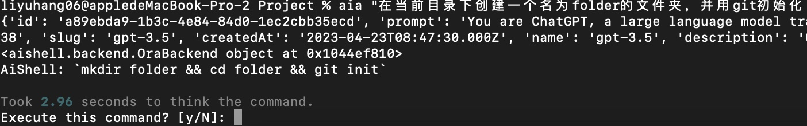

# FreeAiShell

无限制，无需申请，免费使用的AiShell。灵感来源于[aishell](https://github.com/code-yeongyu/AiShell.git)，后端基于[gpt4free](https://github.com/xtekky/gpt4free)。

# 使用
pip 安装
```bash
pip install freeai_shell
```
使用
```bash
ais "在当前目录下创建一个名为folder的文件夹，并用git初始化"
```
结果


# 源码安装
克隆源码

```bash
git clone https://github.com/piDack/FreeAiShell.git
```

更新依赖 & 安装
```bash
pip install -r requirements.txt
python3 setup.py install
```